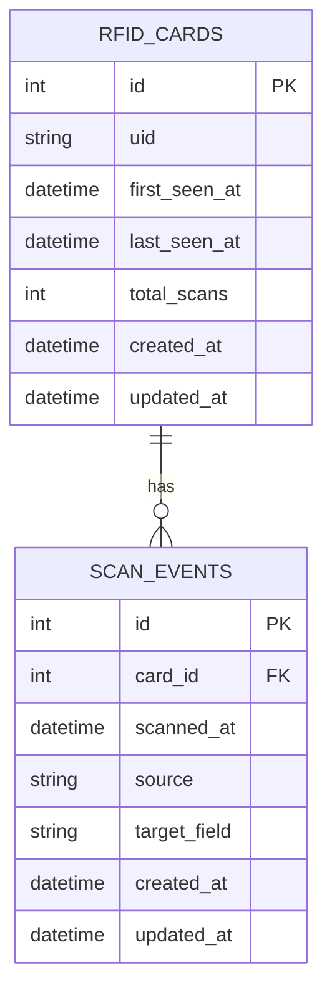

# SimpleRFID


SimpleRFID is a Laravel-based RFID scan logging app. It records RFID card scans, tracks card activity, and exposes simple JSON APIs for scan and card history.

## Stack

- PHP 8.4
- Laravel 12
- MySQL (recommended)
- Vite + Tailwind CSS (frontend tooling)

## Quick Start

### 1) Install dependencies

```bash
composer install
npm install
```

### 2) Configure environment

```bash
cp .env.example .env
php artisan key:generate
```

Set your DB connection in `.env` (host, database, username, password).

### 3) Run migrations

```bash
php artisan migrate
```

### 4) Run in development

```bash
composer run dev
```

This starts Laravel, queue listener, logs, and Vite concurrently.

## API Endpoints

Base URL: `http://127.0.0.1:8000/api`

- `GET /health` - Database connectivity check
- `POST /scans` - Store a scan event
- `GET /scans` - Latest scan events (up to 100)
- `GET /cards` - Latest cards by activity (up to 100)
- `GET /safety/db` - FK + orphan + duplicate UID safety checks

### Example: Create scan

```http
POST /api/scans
Content-Type: application/json

{
  "uid": "04AABBCCDD",
  "scanned_at": "2026-03-02T12:34:56Z",
  "source": "web-serial",
  "target_field": "rfid_input"
}
```

## Data Model (Core)

- `rfid_cards` (unique `uid`, first/last seen timestamps, total scans)
- `scan_events` (references `rfid_cards.id`, scan timestamp, source, target field)
- `users`, `sessions`, `password_reset_tokens` (Laravel auth/session defaults)

### ERD (Core)



## Project Structure (Relevant)

- `app/Http/Controllers/Api/ScanController.php` - RFID API controller
- `app/Models/RfidCard.php` - Card model
- `app/Models/ScanEvent.php` - Scan event model
- `database/migrations/` - Schema migrations
- `public/rfid-demo/` - Demo frontend

## Testing

```bash
php artisan test --compact
```

## Notes

- The project also contains an extended SQL reference in `schema.sql`.
- Prefer Laravel migrations as the source of truth for schema evolution.

## Diagrams

# Entity-Relationship Diagram


# Flowchart
